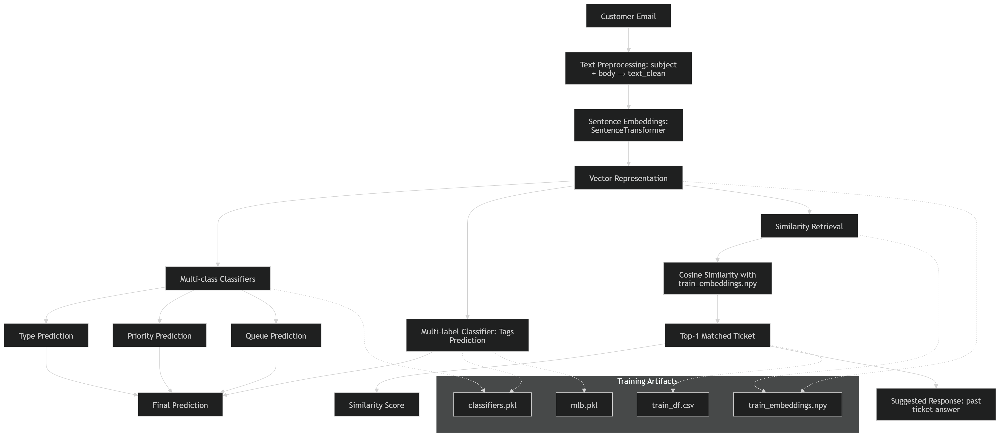

````markdown
# Customer Support NLP Ticket Classifier

Customer support teams often face overwhelming volumes of emails, making it difficult to quickly categorize, prioritize, and respond to customer issues. Misrouted tickets, delayed responses, or overlooked feedback can lead to frustrated customers and lost business opportunities.  

This project solves that problem by providing an intelligent NLP system that automates the processing of customer emails. It can:

- Classify ticket type (Incident, Problem, Question, Feedback, etc.)  
- Determine priority (Low, Medium, High)  
- Route to the correct queue/department
- Assign relevant tags (Bug, Marketing, Technical, etc.)  
- Suggest responses based on similar past tickets  

By combining text preprocessing, sentence embeddings, multi-class and multi-label classification, and retrieval-based suggestions, this system helps support teams save time, reduce errors, and improve customer satisfaction.

# Table of Contents

1. [Project Structure](#project-structure)  
2. [Dataset](#dataset)  
3. [Installation](#installation)  
4. [Preprocessing](#preprocessing)  
5. [Training](#training)  
6. [Prediction](#prediction)  
7. [Saved Models & Artifacts](#saved-models--artifacts)  
8. [Example](#example)  
9. [Evaluation](#evaluation)  
10. [Credits](#credits)


## Project Structure

project-name/
│
├── data/                 # Dataset (raw + cleaned)
│   └── clean_data.csv
├── notebooks/            # Exploratory and experimental notebooks
├── saved_models/         # Trained models & embeddings (after training)
│   ├── classifiers.pkl
│   ├── mlb.pkl
│   ├── embedding_model/
│   ├── train_embeddings.npy
│   └── train_df.csv
├── src/                  # Reusable scripts
│   ├── preprocess.py
│   ├── train.py
│   └── predict.py
└── README.md             # Project documentation
````

---

##  Dataset

* Original dataset: [Customer Support Tickets Dataset](https://huggingface.co/datasets/Tobi-Bueck/customer-support-tickets)
* Format:

| Column       | Description                           |
| ------------ | ------------------------------------- |
| subject      | Email subject line                    |
| body         | Email body text                       |
| answer       | Response text from support            |
| type         | Ticket type (Incident, Problem, etc.) |
| queue        | Department / queue                    |
| priority     | Ticket priority                       |
| language     | Language of the email                 |
| version      | Dataset version (optional)            |
| tag_1..tag_8 | Optional tags                         |

> **Note**: During preprocessing, `language="de"` is dropped and `version` is removed.

---

## Installation

1. Clone repository:

```bash
git clone https://github.com/yourusername/customer-support-nlp.git
cd customer-support-nlp
```

2. Create virtual environment:

```bash
python -m venv venv
source venv/bin/activate   # Linux/Mac
venv\Scripts\activate      # Windows
```

3. Install dependencies:

```bash
pip install -r requirements.txt
```

**Key dependencies**:

| Package               | Purpose                 |
| --------------------- | ----------------------- |
| pandas                | Data handling           |
| numpy                 | Array operations        |
| scikit-learn          | Classifiers, evaluation |
| sentence-transformers | Embeddings              |
| joblib                | Model persistence       |

---

##  Preprocessing

All preprocessing is in `src/preprocess.py`.

**Steps:**

1. Load raw dataset:

```python
from src.preprocess import load_dataset, clean_data, save_clean_data

df = load_dataset("data/customer_support.csv")
df_clean = clean_data(df)
save_clean_data(df_clean, "data/clean_data.csv")
```

2. Cleaning includes:

* Keep only English emails (`language="en"`)
* Drop `version` column
* Combine `subject` + `body` into `text_clean`
* Create list of tags from `tag_1..tag_8`

---

##  Training

All training is in `src/train.py`.

```python
from src.train import train_models

# df_clean from preprocessing
classifiers, mlb, embed_model, embeddings = train_models(df_clean)
```

**What it does:**

| Component            | Description                                                |
| -------------------- | ---------------------------------------------------------- |
| classifiers.pkl      | Logistic regression models for type, priority, queue, tags |
| mlb.pkl              | MultiLabelBinarizer for decoding tags                      |
| train_embeddings.npy | Precomputed sentence embeddings                            |
| embedding_model/     | SentenceTransformer model                                  |
| train_df.csv         | Cleaned dataset for retrieval                              |

**Notes:**

* Embeddings used: `all-MiniLM-L6-v2`
* Multi-label prediction for tags
* Normalized embeddings for cosine similarity retrieval

---

##  Prediction

Use `src/predict.py`:

```python
from src.predict import TicketPredictor

predictor = TicketPredictor("saved_models")

query = "Our digital marketing campaigns are underperforming."
result = predictor.predict_ticket(query)
predictor.pretty_print(result, query)
```

**Output Includes:**

* Type, Priority, Queue, Tags
* Matched past case query
* Suggested response
* Similarity score

---

##  Saved Models & Artifacts

| File / Folder        | Role                                            |
| -------------------- | ----------------------------------------------- |
| classifiers.pkl      | Prediction models (type, priority, queue, tags) |
| mlb.pkl              | MultiLabelBinarizer for tags                    |
| embedding_model/     | SentenceTransformer embeddings model            |
| train_embeddings.npy | Precomputed vector representations              |
| train_df.csv         | Source for retrieval & answer suggestions       |

> Modular structure allows updating embeddings, classifiers, or dataset independently.

---

##  Example Output

```
===== YOUR QUERY =====

Our digital marketing campaigns are underperforming.

===== PREDICTION =====

Type      : Problem
Priority  : Medium
Queue     : Product Support
Tags      : Feedback, Marketing, Performance

===== MATCHED PAST CASE =====

Assistance required for marketing campaign performance customer support. Efforts for SEO improvements and content updates did not meet targets.

===== SUGGESTED RESPONSE =====

Thank you for contacting us regarding your campaign performance. We can help analyze targeting strategies and schedule a call to discuss improvements.

===== CONFIDENCE =====
Similarity Score: 0.870
```

---

## Evaluation

The following table summarizes the model performance across key tasks:

| Task     | Metric          | Score |
|----------|----------------|-------|
| Type     | Accuracy        | 0.80  |
| Priority | Accuracy        | 0.50  |
| Queue    | Accuracy        | 0.31  |
| Tags     | Weighted F1    | 0.33* |

\*Weighted F1 for multi-label tags (example: top-performing tags averaged)

### Detailed Notes

- **Type Model**: High accuracy for Change and Request tickets; lower for Problem tickets.  
- **Priority Model**: Medium accuracy overall, high class imbalance affects low-priority detection.  
- **Queue Model**: Low overall accuracy due to multiple classes; some queues (Billing, Service Outages) perform better than others.  
- **Tags**: Multi-label F1 reflects overlapping tags per ticket; weighted average gives realistic performance.

---

## How it Works

1. **Preprocessing**: Clean text + combine tags
2. **Training**: Train classifiers + compute embeddings
3. **Inference**: Embed new query → predict type/priority/queue/tags → retrieve most similar past ticket → suggest response

**Diagram:**


---

##  Credits

* Dataset: [Tobi-Bueck / Customer Support Tickets](https://huggingface.co/datasets/Tobi-Bueck/customer-support-tickets)
* Embeddings: [Sentence-Transformers](https://www.sbert.net/)
* Python packages: `scikit-learn`, `pandas`, `numpy`, `joblib`

---
